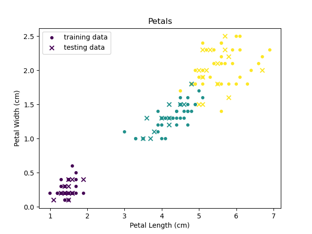

# KNN_Iris_MWE
This is a repository for the minimum working example of K nearest neighbors using the Iris dataset.

# Description

In this dataset, there are 150 flowers; 50 samples for each of three flowers species. The three flower species are the Iris Setosa, the Iris Versicolor, and the Iris Virginica. There are four attributes: sepal length, sepal width, petal length, and petal width, all measured in centimeters.

# Experiments

## Overview 

I classified and graphed flowers in Python. 

## Details

I classified the Iris flower dataset in three steps. First I split the data, using SKlearn. Then, I graphed the split data, using Matplotlib. Finally, I trained my data on KNearestNeighbors, using SKlearn, to predict the type of flower. This allows me to show the Iris dataset in a visual way, while practicing my machine learning skills. 

# Graphs of the Iris dataset.
## Iris Sepals

## Iris Petals

# Analysis

## Overview

The petal sizes in the different flower species are less mixed together than the sepal sizes.

## Details 

none

# Conclusion 

In conclusion, I feel like I have succeeded greatly in classifying and graphing flowers in Python. My accuracy rating ranges from 90% - 99%, which I think is great.

